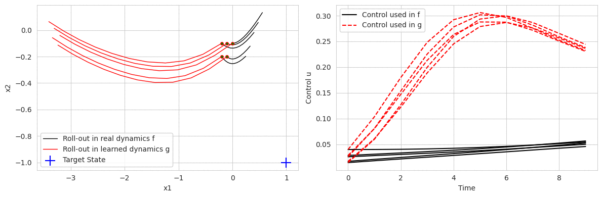

## Codes for neural ode control

Paper: https://arxiv.org/abs/2401.01836

Neural ODE Control is a neural ODE based method for controlling unknown dynamical systems,  which combines dynamics identification and optimal control learning using a coupled neural ODE. Through an intriguing interplay between the two neural networks in coupled neural ODE structure, our model concurrently learns system dynamics as well as optimal controls that guides towards target states. Our experiments demonstrate the effectiveness of our model for learning optimal control of unknown dynamical systems.

Basically, the neural ODE strcuture that we use is 

And we can get the trajectory - which is the predicted trajectory under the current controller via

From which we can build our loss function: minimize the control objective loss (e.g. distance between XT and some target states) and the trajectory fitting loss (e.g. deviations between real trajectories in the environment using current controller and the predicted trajectories)

## Learning Process

The following animation demonstrates the learning process of NODEC on simple dynamics, showing the rollout in learned dynamics versus ground truth dynamics. 

The rollout diagram is on left hand side, and the control used during that rollout is on the right hand side. The rollouts with the same controller being trained are done both in learned dyanmics (g) and in ground truth dynamics (f). 

As training epochs goes, we can observe that:

- The learned dynamics becomes increasingly accurate compared to the ground truth (rollout lines getting closer)
- The control quality improves as the system gets closer to the target state

