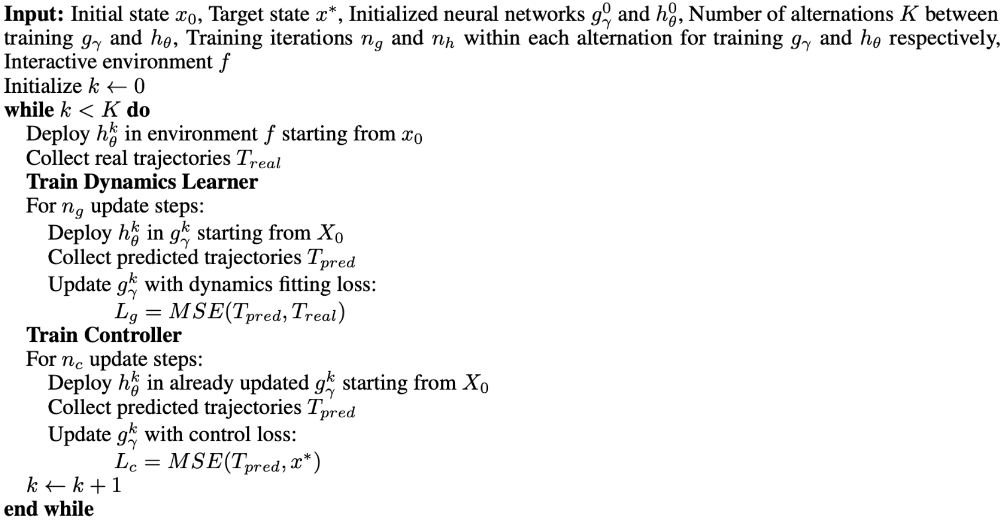

# Neural ODE Control (NODEC)

**Paper:** [Neural ODE Control: A Neural ODE Based Method for Controlling Unknown Dynamical Systems](https://arxiv.org/abs/2401.01836)

## Overview

Neural ODE Control (NODEC) is a novel approach for controlling unknown dynamical systems that combines dynamics identification and optimal control learning using a coupled neural ODE architecture. Through an intriguing interplay between two neural networks in the coupled structure, our model concurrently learns both system dynamics and optimal controls that guide the system towards target states. Our experiments demonstrate the effectiveness of NODEC for learning optimal control of unknown dynamical systems.

## Architecture

The NODEC architecture based on neural ODE is illustrated below: 

We can obtain the predicted rollout trajectory under the current controller using the above equation. If we swap the learned dynamics gγ with the ground truth dynamics f, we can obtain the real rollout trajectory under the current controller hθ.

These two rollouts are essential for training both the dynamics learner gγ and the controller hθ.

## Training Algorithm

The training process for NODEC follows the algorithm illustrated below:

## Loss Function

From the architecture, we can build our loss function by minimizing two key components:

- **Control Objective Loss**: Distance between the final state X_T and target states
- **Trajectory Fitting Loss**: Deviations between real trajectories in the environment (using the current controller) and the predicted trajectories

## Learning Process

The following animation demonstrates the learning process of NODEC on simple dynamics, showing the rollout in learned dynamics versus ground truth dynamics.

**Animation Layout:**
- **Left side**: Rollout diagram showing trajectory evolution
- **Right side**: Control signal used during that rollout

The rollouts with the same controller hθ being trained are performed in both:
- **Learned dynamics (gγ)**: The neural network's approximation of the system
- **Ground truth dynamics (f)**: The actual system dynamics

**Key Observations as Training Progresses:**

- The learned dynamics becomes increasingly accurate compared to the ground truth (rollout lines converge)
- The control quality improves as the system gets closer to the target state
- Through mutual supervision between the dynamics learner gγ and controller hθ networks, the model simultaneously learns optimal control and system dynamics

